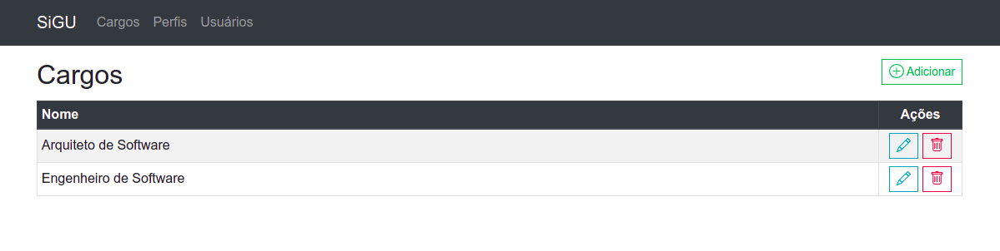

# SiGU - Sistema de Gerenciamento de Usuários

Exemplo de projeto Spring MVC usando o framework [Spring Boot][1] com JPA,
[Thymeleaf][2], [Bootstrap][3], [Vue.js][4], [BootstrapVue][5],
[VeeValidate][6], [v-mask][7], [PostgreSQL][8] e Java 15.

## Construindo e executando

Este projeto já está preparado para ser executado com o Docker. Podendo também
ser executado sem ele. Nesse caso será necessário ter instalado o Java (versão 15)
e PostgreSQL.

**Com docker**:
```shell
./gradlew clean build
docker-compose -up
```

**Sem docker**:
```shell
./gradlew clean build
 ./build/libs/sigu-0.0.1-SNAPSHOT.jar
```

## Telas

### Home


### Cargos




### Perfis


### Usuários


[1]: https://spring.io/projects/spring-boot
[2]: https://www.thymeleaf.org/
[3]: https://getbootstrap.com/
[4]: https://vuejs.org/
[5]: https://bootstrap-vue.org/
[6]: https://logaretm.github.io/vee-validate/
[7]: https://github.com/probil/v-mask
[8]: https://www.postgresql.org/
